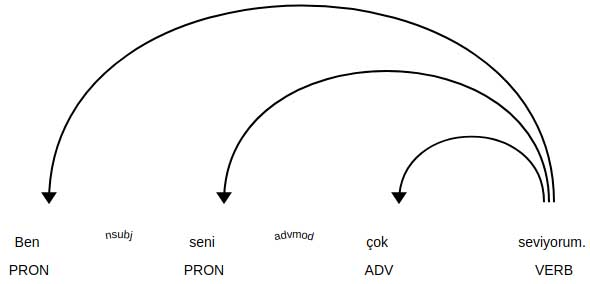

1. Run the [Jupyter Notebook](http://jupyter.org/) and create new notebook in browser window. Import *spacy*, *displacy* and load *tr_unnamed model*.
```python
import spacy
from spacy import displacy
nlp = spacy.load('tr_unnamed')
```

2. Process whole sentence and visualize the results.
```python
doc1 = nlp('Ben seni çok seviyorum.')
for token in doc1:
    print(token.text, token.lemma_, token.pos_, token.tag_)
displacy.render(doc1, style='dep', jupyter=True)
```

 The results of sentence processing:
```
Ben Ben PRON Pers
seni seni PRON Pers
çok çok ADV Adverb
seviyorum sev VERB Verb
. . PUNCT Punc
```



