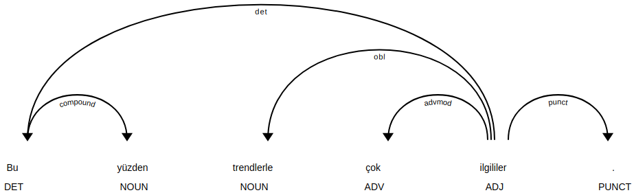

### spaCy model quality assessment.

To assess the performance of the spaCy model, a library *comparator.py* was created. For conll format parsing we use some libraries of [CoNLL-U Parser](https://github.com/EmilStenstrom/conllu) without its installation. [CoNLL-U Parser](https://github.com/EmilStenstrom/conllu) parses a conll formatted string into a ordered python dictionary.

With library *comparator.py* we can do following:
1. Getting conll from spaCy doc for one sentence.
2. Checking the equality of the two trees (sentences) in conll format.
3. Getting ordered python dictionary from tree in conll format (by using [CoNLL-U Parser](https://github.com/EmilStenstrom/conllu)).
4. Comparing two trees (sentences) in conll format by [DEPREL](http://universaldependencies.org/u/dep/index.html) and HEAD fields. HEAD - Head of the current word, which is either a value of ID or zero.
5. Comparing two trees (sentences) in conll format by [UPOS](http://universaldependencies.org/u/pos/index.html) and XPOS fields. XPOS - language-specific part-of-speech tag; underscore if not available.
6. Comparing two trees (sentences) in conll format by FORM and LEMMA fields. FORM - word form or punctuation symbol. LEMMA - lemma or stem of word form.
7. Сhecking the tree for bad lines. Bad line begins not from word index as integer value. For example:
```bash
2-3	Buradaki	_	_	_	_	_	_	_	_
```
```bash
6-7	yoktu	_	_	_	_	_	_	_	SpaceAfter=No
```
```bash
3-4	bıyıklı	_	_	_	_	_	_	_	SpaceAfter=No
```
8. Reading conll file tree by tree. So that one iteration gives a tree and original sentence. For example:
```bash
Tam umudunu kesip geri döneceği sırada şehrin en ucundan çıkan dumanı görmüş.
1	Tam	tam	ADV	Adverb	_	2	advmod	_	_
2	umudunu	umut	NOUN	Noun	Case=Acc|Number=Sing|Number[psor]=Sing|Person=3|Person[psor]=3	4	obl	_	_
3	kesip	kes	VERB	Verb	Aspect=Perf|Mood=Ind|Polarity=Pos|Tense=Pres|VerbForm=Conv	2	compound	_	_
4	geri	geri	ADJ	NAdj	Case=Nom|Number=Sing|Person=3	6	amod	_	_
5	döneceği	dön	VERB	Verb	Aspect=Perf|Mood=Ind|Number[psor]=Sing|Person[psor]=3|Polarity=Pos|Tense=Fut|VerbForm=Part	4	compound	_	_
6	sırada	sıra	NOUN	Noun	Case=Loc|Number=Sing|Person=3	12	obl	_	_
7	şehrin	şehir	NOUN	Noun	Case=Gen|Number=Sing|Person=3	9	nmod:poss	_	_
8	en	en	ADV	Adverb	_	9	advmod	_	_
9	ucundan	uç	NOUN	Noun	Case=Abl|Number=Sing|Number[psor]=Sing|Person=3|Person[psor]=3	10	obl	_	_
10	çıkan	çık	VERB	Verb	Aspect=Perf|Mood=Ind|Polarity=Pos|Tense=Pres|VerbForm=Part	11	acl	_	_
11	dumanı	duman	NOUN	Noun	Case=Acc|Number=Sing|Person=3	12	obj	_	_
12	görmüş	gör	VERB	Verb	Aspect=Perf|Evident=Nfh|Mood=Ind|Number=Sing|Person=3|Polarity=Pos|Tense=Past	0	root	_	SpaceAfter=No
13	.	.	PUNCT	Punc	_	12	punct	_	_
```
9. Converting conll string to [displaCy JSON](https://github.com/explosion/spaCy/issues/1215). Example of displaCy json:
```json
{'arcs': [{'end': 4, 'start': 0, 'dir': 'left', 'label': 'det'}, {'end': 1, 'start': 0, 'dir': 'right', 'label': 'compound'}, {'end': 4, 'start': 2, 'dir': 'left', 'label': 'obl'}, {'end': 4, 'start': 3, 'dir': 'left', 'label': 'advmod'}, {'end': 5, 'start': 4, 'dir': 'right', 'label': 'punct'}], 'words': [{'text': 'Bu', 'tag': 'DET'}, {'text': 'yüzden', 'tag': 'NOUN'}, {'text': 'trendlerle', 'tag': 'NOUN'}, {'text': 'çok', 'tag': 'ADV'}, {'text': 'ilgililer', 'tag': 'ADJ'}, {'text': '.', 'tag': 'PUNCT'}]}
```
Appropriate visualization result:


The first quality checking was performed on [tr-ud-train.conllu](https://github.com/UniversalDependencies/UD_Turkish/blob/master/tr-ud-train.conllu) data file. We compare the original tree with tree obtained on the model by three criterion: DEPREL, POS, LEMMA (items 4, 5, 6 in upper list). We 
have got following results (number of examples 3685):
- error in DEPREL - 1157 items;
- error in POS - 1302 items;
- error in LEMMA - 2688 items;
- error in DEPREL or POS or LEMMA - 2863 items.

It was found that we trained model with 1087 bad lines in 884 trouble trees. After exclusion of trouble trees and retraining of the model, the following result was obtained (number of examples 2801):
- error in DEPREL - 282 items;
- error in POS - 425 items;
- error in LEMMA - 1804 items;
- error in DEPREL or POS or LEMMA - 1981 items.

All problem items with error in DEPREL were saved as html files. For example:
```html
<!DOCTYPE html>
<html>
 <head>
  <title>
   displaCy
  </title>
 </head>
 <body style="font-size: 16px; font-family: -apple-system, BlinkMacSystemFont, 'Segoe UI', Helvetica, Arial, sans-serif, 'Apple Color Emoji', 'Segoe UI Emoji', 'Segoe UI Symbol'; padding: 4rem 2rem;">
  <h2>
   Original tree:
  </h2>
  <textarea>1	Sanal	sanal	ADJ	Adj	_	2	amod	_	_
2	parçacıklar	parçacık	NOUN	Noun	Case=Nom|Number=Plur|Person=3	6	csubj	_	_
3	sa	i	AUX	Zero	Aspect=Perf|Mood=Cnd|Number=Sing|Person=3|Tense=Pres	2	cop	_	_
4	bunların	bu	PRON	Demons	Case=Gen|Number=Plur|Person=3|PronType=Dem	5	nmod:poss	_	_
5	hiçbirini	hiçbiri	PRON	Quant	Case=Acc|Number=Sing|Number[psor]=Sing|Person=3|Person[psor]=3|PronType=Ind	6	obj	_	_
6	yapamazlar	yap	VERB	Verb	Aspect=Imp|Mood=Pot|Number=Plur|Person=3|Polarity=Neg|Tense=Aor	0	root	_	SpaceAfter=No
7	.	.	PUNCT	Punc	_	6	punct	_	_</textarea>
  <figure style="margin-bottom: 6rem">
   <svg class="displacy" height="312.0" id="0" style="max-width: none; height: 312.0px; color: #000000; background: #ffffff; font-family: Arial" width="1275" xmlns="http://www.w3.org/2000/svg" xmlns:xlink="http://www.w3.org/1999/xlink">
    <text class="displacy-token" fill="currentColor" text-anchor="middle" y="222.0">
     <tspan class="displacy-word" fill="currentColor" x="50">
      Sanal
     </tspan>
     <tspan class="displacy-tag" dy="2em" fill="currentColor" x="50">
      ADJ
     </tspan>
    </text>
    <text class="displacy-token" fill="currentColor" text-anchor="middle" y="222.0">
     <tspan class="displacy-word" fill="currentColor" x="225">
      parçacıklar
     </tspan>
     <tspan class="displacy-tag" dy="2em" fill="currentColor" x="225">
      NOUN
     </tspan>
    </text>
    <text class="displacy-token" fill="currentColor" text-anchor="middle" y="222.0">
     <tspan class="displacy-word" fill="currentColor" x="400">
      sa
     </tspan>
     <tspan class="displacy-tag" dy="2em" fill="currentColor" x="400">
      AUX
     </tspan>
    </text>
    <text class="displacy-token" fill="currentColor" text-anchor="middle" y="222.0">
     <tspan class="displacy-word" fill="currentColor" x="575">
      bunların
     </tspan>
     <tspan class="displacy-tag" dy="2em" fill="currentColor" x="575">
      PRON
     </tspan>
    </text>
    <text class="displacy-token" fill="currentColor" text-anchor="middle" y="222.0">
     <tspan class="displacy-word" fill="currentColor" x="750">
      hiçbirini
     </tspan>
     <tspan class="displacy-tag" dy="2em" fill="currentColor" x="750">
      PRON
     </tspan>
    </text>
    <text class="displacy-token" fill="currentColor" text-anchor="middle" y="222.0">
     <tspan class="displacy-word" fill="currentColor" x="925">
      yapamazlar
     </tspan>
     <tspan class="displacy-tag" dy="2em" fill="currentColor" x="925">
      VERB
     </tspan>
    </text>
    <text class="displacy-token" fill="currentColor" text-anchor="middle" y="222.0">
     <tspan class="displacy-word" fill="currentColor" x="1100">
      .
     </tspan>
     <tspan class="displacy-tag" dy="2em" fill="currentColor" x="1100">
      PUNCT
     </tspan>
    </text>
    <g class="displacy-arrow">
     <path class="displacy-arc" d="M70,177.0 C70,89.5 220.0,89.5 220.0,177.0" fill="none" id="arrow-0-0" stroke="currentColor" stroke-width="2px">
     </path>
     <text dy="1.25em" style="font-size: 0.8em; letter-spacing: 1px">
      <textpath class="displacy-label" fill="currentColor" startoffset="50%" text-anchor="middle" xlink:href="#arrow-0-0">
       amod
      </textpath>
     </text>
     <path class="displacy-arrowhead" d="M70,179.0 L62,167.0 78,167.0" fill="currentColor">
     </path>
    </g>
    <g class="displacy-arrow">
     <path class="displacy-arc" d="M245,177.0 C245,2.0 925.0,2.0 925.0,177.0" fill="none" id="arrow-0-1" stroke="currentColor" stroke-width="2px">
     </path>
     <text dy="1.25em" style="font-size: 0.8em; letter-spacing: 1px">
      <textpath class="displacy-label" fill="currentColor" startoffset="50%" text-anchor="middle" xlink:href="#arrow-0-1">
       csubj
      </textpath>
     </text>
     <path class="displacy-arrowhead" d="M245,179.0 L237,167.0 253,167.0" fill="currentColor">
     </path>
    </g>
    <g class="displacy-arrow">
     <path class="displacy-arc" d="M245,177.0 C245,89.5 395.0,89.5 395.0,177.0" fill="none" id="arrow-0-2" stroke="currentColor" stroke-width="2px">
     </path>
     <text dy="1.25em" style="font-size: 0.8em; letter-spacing: 1px">
      <textpath class="displacy-label" fill="currentColor" startoffset="50%" text-anchor="middle" xlink:href="#arrow-0-2">
       cop
      </textpath>
     </text>
     <path class="displacy-arrowhead" d="M395.0,179.0 L403.0,167.0 387.0,167.0" fill="currentColor">
     </path>
    </g>
    <g class="displacy-arrow">
     <path class="displacy-arc" d="M595,177.0 C595,89.5 745.0,89.5 745.0,177.0" fill="none" id="arrow-0-3" stroke="currentColor" stroke-width="2px">
     </path>
     <text dy="1.25em" style="font-size: 0.8em; letter-spacing: 1px">
      <textpath class="displacy-label" fill="currentColor" startoffset="50%" text-anchor="middle" xlink:href="#arrow-0-3">
       nmod:poss
      </textpath>
     </text>
     <path class="displacy-arrowhead" d="M595,179.0 L587,167.0 603,167.0" fill="currentColor">
     </path>
    </g>
    <g class="displacy-arrow">
     <path class="displacy-arc" d="M770,177.0 C770,89.5 920.0,89.5 920.0,177.0" fill="none" id="arrow-0-4" stroke="currentColor" stroke-width="2px">
     </path>
     <text dy="1.25em" style="font-size: 0.8em; letter-spacing: 1px">
      <textpath class="displacy-label" fill="currentColor" startoffset="50%" text-anchor="middle" xlink:href="#arrow-0-4">
       obj
      </textpath>
     </text>
     <path class="displacy-arrowhead" d="M770,179.0 L762,167.0 778,167.0" fill="currentColor">
     </path>
    </g>
    <g class="displacy-arrow">
     <path class="displacy-arc" d="M945,177.0 C945,89.5 1095.0,89.5 1095.0,177.0" fill="none" id="arrow-0-5" stroke="currentColor" stroke-width="2px">
     </path>
     <text dy="1.25em" style="font-size: 0.8em; letter-spacing: 1px">
      <textpath class="displacy-label" fill="currentColor" startoffset="50%" text-anchor="middle" xlink:href="#arrow-0-5">
       punct
      </textpath>
     </text>
     <path class="displacy-arrowhead" d="M1095.0,179.0 L1103.0,167.0 1087.0,167.0" fill="currentColor">
     </path>
    </g>
   </svg>
  </figure>
  <h2>
   Obtained tree:
  </h2>
  <textarea>1	Sanal	Sanal	ADJ	Adj	_	2	amod	_	_
2	parçacıklarsa	parçacık	VERB	Verb	_	5	nmod	_	_
3	bunların	bu	PRON	Demons	_	4	nmod:poss	_	_
4	hiçbirini	hiçbiri	X	Quant	_	5	obj	_	_
5	yapamazlar	yap	VERB	Verb	_	0	root	_	_
6	.	.	PUNCT	Punc	_	5	punct	_	_</textarea>
  <figure style="margin-bottom: 6rem">
   <svg class="displacy" height="312.0" id="1" style="max-width: none; height: 312.0px; color: #000000; background: #ffffff; font-family: Arial" width="1100" xmlns="http://www.w3.org/2000/svg" xmlns:xlink="http://www.w3.org/1999/xlink">
    <text class="displacy-token" fill="currentColor" text-anchor="middle" y="222.0">
     <tspan class="displacy-word" fill="currentColor" x="50">
      Sanal
     </tspan>
     <tspan class="displacy-tag" dy="2em" fill="currentColor" x="50">
      ADJ
     </tspan>
    </text>
    <text class="displacy-token" fill="currentColor" text-anchor="middle" y="222.0">
     <tspan class="displacy-word" fill="currentColor" x="225">
      parçacıklarsa
     </tspan>
     <tspan class="displacy-tag" dy="2em" fill="currentColor" x="225">
      VERB
     </tspan>
    </text>
    <text class="displacy-token" fill="currentColor" text-anchor="middle" y="222.0">
     <tspan class="displacy-word" fill="currentColor" x="400">
      bunların
     </tspan>
     <tspan class="displacy-tag" dy="2em" fill="currentColor" x="400">
      PRON
     </tspan>
    </text>
    <text class="displacy-token" fill="currentColor" text-anchor="middle" y="222.0">
     <tspan class="displacy-word" fill="currentColor" x="575">
      hiçbirini
     </tspan>
     <tspan class="displacy-tag" dy="2em" fill="currentColor" x="575">
      X
     </tspan>
    </text>
    <text class="displacy-token" fill="currentColor" text-anchor="middle" y="222.0">
     <tspan class="displacy-word" fill="currentColor" x="750">
      yapamazlar
     </tspan>
     <tspan class="displacy-tag" dy="2em" fill="currentColor" x="750">
      VERB
     </tspan>
    </text>
    <text class="displacy-token" fill="currentColor" text-anchor="middle" y="222.0">
     <tspan class="displacy-word" fill="currentColor" x="925">
      .
     </tspan>
     <tspan class="displacy-tag" dy="2em" fill="currentColor" x="925">
      PUNCT
     </tspan>
    </text>
    <g class="displacy-arrow">
     <path class="displacy-arc" d="M70,177.0 C70,89.5 220.0,89.5 220.0,177.0" fill="none" id="arrow-1-0" stroke="currentColor" stroke-width="2px">
     </path>
     <text dy="1.25em" style="font-size: 0.8em; letter-spacing: 1px">
      <textpath class="displacy-label" fill="currentColor" startoffset="50%" text-anchor="middle" xlink:href="#arrow-1-0">
       amod
      </textpath>
     </text>
     <path class="displacy-arrowhead" d="M70,179.0 L62,167.0 78,167.0" fill="currentColor">
     </path>
    </g>
    <g class="displacy-arrow">
     <path class="displacy-arc" d="M245,177.0 C245,2.0 750.0,2.0 750.0,177.0" fill="none" id="arrow-1-1" stroke="currentColor" stroke-width="2px">
     </path>
     <text dy="1.25em" style="font-size: 0.8em; letter-spacing: 1px">
      <textpath class="displacy-label" fill="currentColor" startoffset="50%" text-anchor="middle" xlink:href="#arrow-1-1">
       nmod
      </textpath>
     </text>
     <path class="displacy-arrowhead" d="M245,179.0 L237,167.0 253,167.0" fill="currentColor">
     </path>
    </g>
    <g class="displacy-arrow">
     <path class="displacy-arc" d="M420,177.0 C420,89.5 570.0,89.5 570.0,177.0" fill="none" id="arrow-1-2" stroke="currentColor" stroke-width="2px">
     </path>
     <text dy="1.25em" style="font-size: 0.8em; letter-spacing: 1px">
      <textpath class="displacy-label" fill="currentColor" startoffset="50%" text-anchor="middle" xlink:href="#arrow-1-2">
       nmod:poss
      </textpath>
     </text>
     <path class="displacy-arrowhead" d="M420,179.0 L412,167.0 428,167.0" fill="currentColor">
     </path>
    </g>
    <g class="displacy-arrow">
     <path class="displacy-arc" d="M595,177.0 C595,89.5 745.0,89.5 745.0,177.0" fill="none" id="arrow-1-3" stroke="currentColor" stroke-width="2px">
     </path>
     <text dy="1.25em" style="font-size: 0.8em; letter-spacing: 1px">
      <textpath class="displacy-label" fill="currentColor" startoffset="50%" text-anchor="middle" xlink:href="#arrow-1-3">
       obj
      </textpath>
     </text>
     <path class="displacy-arrowhead" d="M595,179.0 L587,167.0 603,167.0" fill="currentColor">
     </path>
    </g>
    <g class="displacy-arrow">
     <path class="displacy-arc" d="M770,177.0 C770,89.5 920.0,89.5 920.0,177.0" fill="none" id="arrow-1-4" stroke="currentColor" stroke-width="2px">
     </path>
     <text dy="1.25em" style="font-size: 0.8em; letter-spacing: 1px">
      <textpath class="displacy-label" fill="currentColor" startoffset="50%" text-anchor="middle" xlink:href="#arrow-1-4">
       punct
      </textpath>
     </text>
     <path class="displacy-arrowhead" d="M920.0,179.0 L928.0,167.0 912.0,167.0" fill="currentColor">
     </path>
    </g>
   </svg>
  </figure>
 </body>
</html>
```


